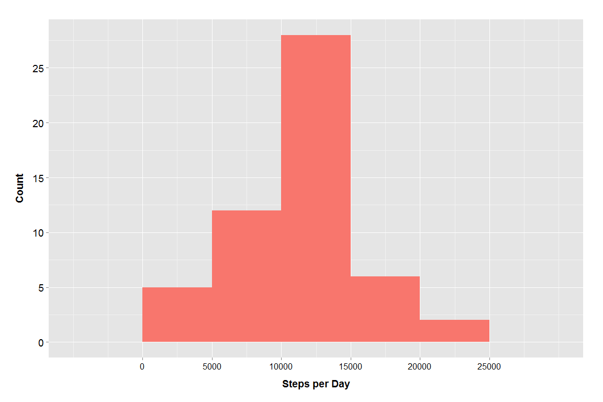
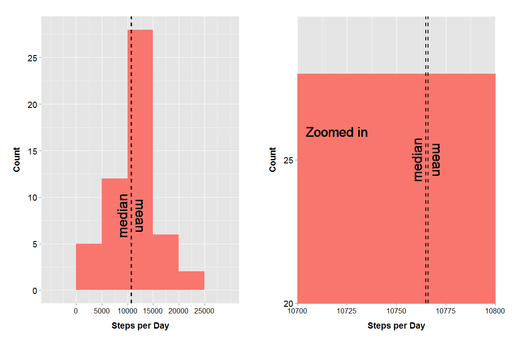
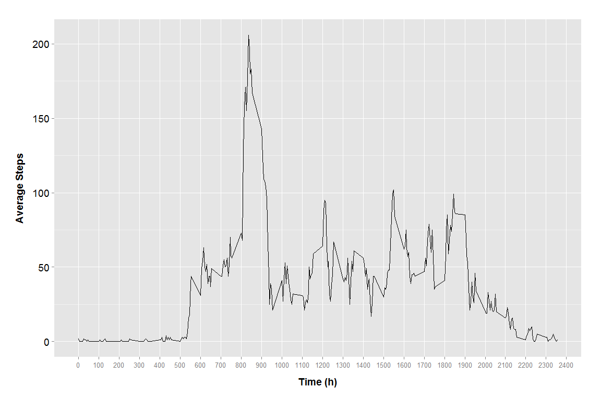
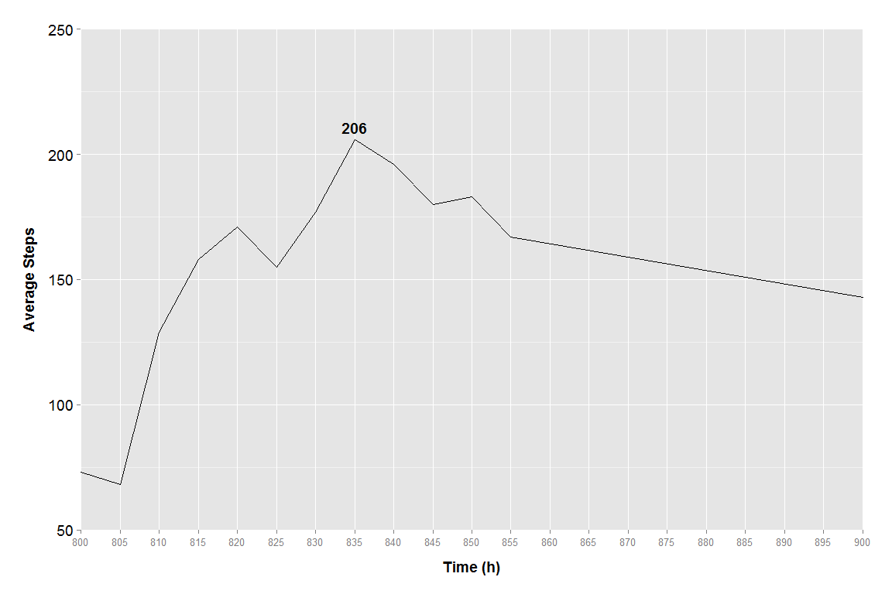
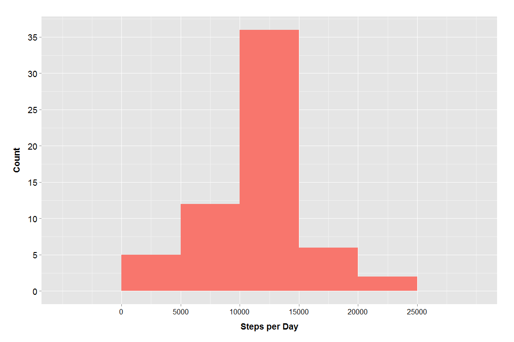
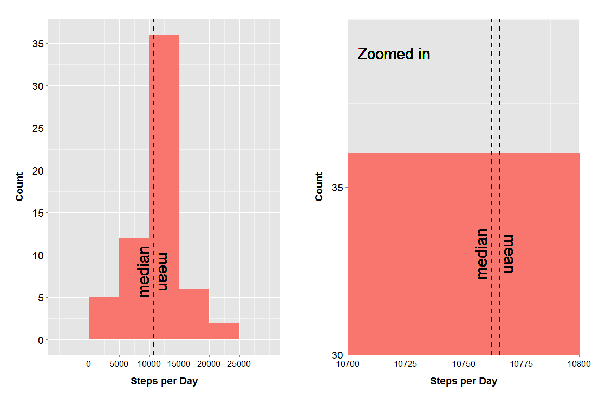
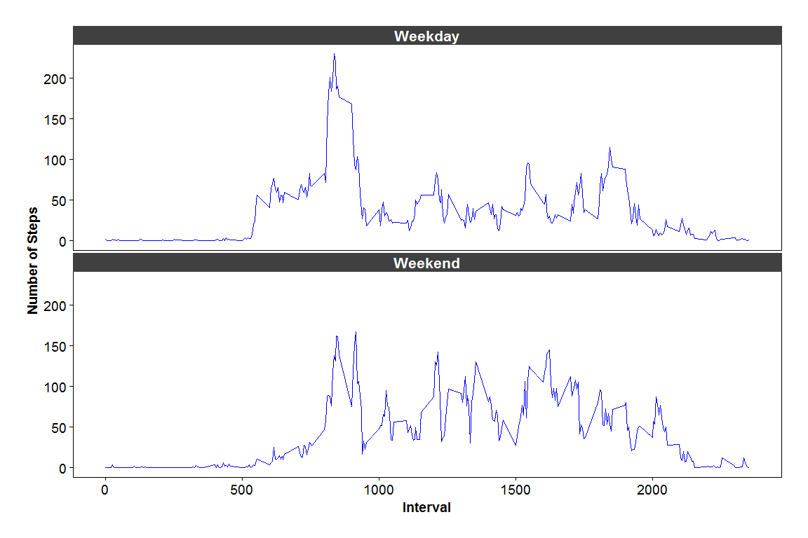

# Reproducible Research: Peer Assessment 1


## Loading and preprocessing the data

Load the libararies that we will use for this script:

```r
library(plyr)
library(ggplot2)
library(grid)
library(chron)
library(knitr)
library(gridExtra)
```

Before we start, let us first make sure that you have the necessary files. Run this script and it'll check, download and unzip the file for you.

```r
if (!file.exists("activity.csv")) {
    fileURL <- "https://d396qusza40orc.cloudfront.net/repdata%2Fdata%2Factivity.zip"
    sub("https","http",fileURL) 
    download.file(fileURL, destfile = "./activity.zip",mode="wb")
    unzip("activity.zip")
    }
```

Then we need to read the data...

```r
data <- read.csv("activity.csv")
```

...and make two tables segregating all the NAs and all the non-NAs

```r
data.without.NA <- data[!(is.na(data$steps)),] 
data.withall.NA <- data[(is.na(data$steps)),] #We will use this later
```

## What is mean total number of steps taken per day?

> Calculate the total number of steps taken per day

To get the total number of steps per day, we will use `ddply` and use the `sum` function to summarize the data.

```r
steps.per.day <- ddply(data.without.NA, .(date), summarize, daily_steps=sum(steps))
head(steps.per.day, 10)
```

```
##          date daily_steps
## 1  2012-10-02         126
## 2  2012-10-03       11352
## 3  2012-10-04       12116
## 4  2012-10-05       13294
## 5  2012-10-06       15420
## 6  2012-10-07       11015
## 7  2012-10-09       12811
## 8  2012-10-10        9900
## 9  2012-10-11       10304
## 10 2012-10-12       17382
```

> Make a histogram of the total number of steps taken each day

Let's do a histogram of the data to get a clearer picture

```r
spd.hist <- ggplot(steps.per.day, aes(x=daily_steps)) +
    geom_histogram(binwidth = 5000, fill ="#F8766D") +
    theme(plot.margin=unit(c(1,1,1,1),"cm")) + 
    scale_y_continuous(breaks=c(0, 5, 10, 15, 20, 25)) + 
    
    #X axis
    xlab("Steps per Day") + 
    theme(axis.title.x=element_text(vjust=-1, size=14, face="bold")) + 
    theme(axis.text.x=element_text(size=12, color="black")) +
    
    #Y axis
    ylab("Count") + 
    theme(axis.text.y=element_text(size=14, color="black")) + 
    theme(axis.title.y=element_text(vjust=2, size=14, face="bold"))
spd.hist + scale_x_continuous(breaks=c(0, 5000, 10000, 15000, 20000, 25000))
```

 

> Calculate and report the mean and median of the total number of steps taken per day

Next, let's calculate the mean and median of the steps per day:

```r
spd.median <- median(steps.per.day$daily_steps)
spd.mean <- mean(steps.per.day$daily_steps)
spd.median
```

```
## [1] 10765
```

```r
spd.mean
```

```
## [1] 10766.19
```

If we are to plot the mean and median to our histogram; visibly, the difference between the two is almost negligible. unless we zoom it in.

```r
spd.hist.vline <- spd.hist +
    geom_vline(xintercept = spd.mean, linetype = 2, size = 1) +
    geom_text(aes(x=spd.mean, label="mean\n", y=8), angle = 270, 
              colour="black", size = 8) +
    geom_vline(xintercept = spd.median, linetype = 2, size = 1) +
    geom_text(aes(x=spd.median, label="median\n", y=8), angle = 90, 
              colour="black", size = 8) +
    scale_x_continuous(breaks=c(0, 5000, 10000, 15000, 20000, 25000))

spd.hist.zoom <- spd.hist +
    geom_vline(xintercept = spd.mean, linetype = 2, size = 1) +
    geom_text(aes(x=spd.mean, label="mean\n", y=25), angle = 270, 
              colour="black", size = 8) +
    geom_vline(xintercept = spd.median, linetype = 2, size = 1) +
    geom_text(aes(x=spd.median, label="median\n", y=25), angle = 90, 
              colour="black", size = 8) +
    geom_text(aes(x=10720, label="Zoomed in", y=26), 
              colour="black", size = 8) +
    coord_cartesian(xlim = c(10700, 10800), ylim = c(20, 30)) +
    scale_x_continuous(breaks=seq(0, 25000, by = 25))

grid.arrange(spd.hist.vline, spd.hist.zoom, ncol=2)
```

 

## What is the average daily activity pattern?

> Make a time series plot (i.e. `type = "l"`) of the 5-minute interval (x-axis) and the average number of steps taken, averaged across all days (y-axis)

To get average of each interval, we'll use `ddply` function again, but this time use the `mean` function to summarize the data.

```r
per.interval.steps <- ddply(data.without.NA, .(interval), summarize, 
                            per_interval_steps=round(mean(steps)))
head(per.interval.steps,10)
```

```
##    interval per_interval_steps
## 1         0                  2
## 2         5                  0
## 3        10                  0
## 4        15                  0
## 5        20                  0
## 6        25                  2
## 7        30                  1
## 8        35                  1
## 9        40                  0
## 10       45                  1
```

Plotting the resulting data, we can see the average steps per hour...

```r
daily.pattern <- ggplot(per.interval.steps, aes(interval, per_interval_steps))+
    geom_line() +
    theme(panel.grid.minor.x=element_blank()) +
    theme(plot.margin=unit(c(1,1,1,1),"cm")) + 
    
    #add and edit x axis label
    xlab("Time (h)") + 
    theme(axis.title.x=element_text(vjust=-1, size=14, face="bold")) + 
    
    #add and edit y axis label
    ylab("Average Steps") + 
    theme(axis.text.y=element_text(size=14, color="black")) + 
    theme(axis.title.y=element_text(vjust=2, size=14, face="bold"))
daily.pattern + scale_x_continuous(breaks = seq(0, 2400, by = 100))
```

 

> Which 5-minute interval, on average across all the days in the dataset, contains the maximum number of steps?

...which peaks between 0800 to 0900 hours. So let's zoom in to that part of the day

```r
daily.pattern + 
    scale_x_continuous(breaks = seq(0, 2400, by = 5)) + 
    coord_cartesian(xlim = c(800, 900), ylim = c(50, 250)) + 
    geom_text(data=per.interval.steps[per.interval.steps$per_interval_steps == 
        max(per.interval.steps$per_interval_steps),], aes(interval, 
        per_interval_steps, label = per_interval_steps),
        fontface="bold", vjust=-.5, size=5)
```

 
I've already labeled the maximum number of steps by 5 minute interval - 206 average steps between 8:30 to 8:35 in the morning (I think someone doesn't want to be late!)

## Imputing missing values

> Calculate and report the total number of missing values in the dataset (i.e. the total number of rows with `NA`s)

First, lets use the subset `data.withall.NA` that we did earlier, and count its rows

```r
nrow(data.withall.NA)
```

```
## [1] 2304
```

> Devise a strategy for filling in all of the missing values in the dataset. The strategy does not need to be sophisticated.

For my un-sophisticated strategy, I will substitute all NA values with the mean of the "per 5-minute interval" values that we got from our previous calculation.


```r
mia.no.more <- merge(per.interval.steps, data.withall.NA, by = "interval")
head(mia.no.more, 10)
```

```
##    interval per_interval_steps steps       date
## 1         0                  2    NA 2012-10-01
## 2         0                  2    NA 2012-11-30
## 3         0                  2    NA 2012-11-04
## 4         0                  2    NA 2012-11-09
## 5         0                  2    NA 2012-11-14
## 6         0                  2    NA 2012-11-10
## 7         0                  2    NA 2012-10-08
## 8         0                  2    NA 2012-11-01
## 9         5                  0    NA 2012-11-09
## 10        5                  0    NA 2012-10-01
```

Then do a bit of tidying up to have our new data ready to ~~marry~~ merge with the non-`NA` data

```r
mia.no.more <- arrange(mia.no.more, date, interval)
mia.no.more <- subset(mia.no.more, select=c(per_interval_steps, 
                                            date, interval))
colnames(mia.no.more)[1] <- "steps"
head(mia.no.more, 10)
```

```
##    steps       date interval
## 1      2 2012-10-01        0
## 2      0 2012-10-01        5
## 3      0 2012-10-01       10
## 4      0 2012-10-01       15
## 5      0 2012-10-01       20
## 6      2 2012-10-01       25
## 7      1 2012-10-01       30
## 8      1 2012-10-01       35
## 9      0 2012-10-01       40
## 10     1 2012-10-01       45
```

> Create a new dataset that is equal to the original dataset but with the missing data filled in.

Next, we now merge this new data to the old ones to fill in the missing data

```r
imputed.data <- rbind(mia.no.more, data.without.NA)
imputed.data <- arrange(imputed.data, date, interval)
head(imputed.data, 10)
```

```
##    steps       date interval
## 1      2 2012-10-01        0
## 2      0 2012-10-01        5
## 3      0 2012-10-01       10
## 4      0 2012-10-01       15
## 5      0 2012-10-01       20
## 6      2 2012-10-01       25
## 7      1 2012-10-01       30
## 8      1 2012-10-01       35
## 9      0 2012-10-01       40
## 10     1 2012-10-01       45
```

> Make a histogram of the total number of steps taken each day and Calculate and report the mean and median total number of steps taken per day. Do these values differ from the estimates from the first part of the assignment? What is the impact of imputing missing data on the estimates of the total daily number of steps?

Calculate the total number of steps per day using this newly formed dataset

```r
imp.steps.per.day <- ddply(imputed.data, .(date), summarize, 
                           daily_steps=sum(steps))
head(imp.steps.per.day, 10)
```

```
##          date daily_steps
## 1  2012-10-01       10762
## 2  2012-10-02         126
## 3  2012-10-03       11352
## 4  2012-10-04       12116
## 5  2012-10-05       13294
## 6  2012-10-06       15420
## 7  2012-10-07       11015
## 8  2012-10-08       10762
## 9  2012-10-09       12811
## 10 2012-10-10        9900
```

and then plot another histogram.

```r
imp.spd.hist <- ggplot(imp.steps.per.day, aes(x=daily_steps)) +
    geom_histogram(binwidth = 5000, fill ="#F8766D") + 
    theme(plot.margin=unit(c(1,1,1,1),"cm")) + 
    scale_y_continuous(breaks=c(0, 5, 10, 15, 20, 25, 30, 35)) + 
    
    #X axis
    xlab("Steps per Day") + 
    theme(axis.title.x=element_text(vjust=-1, size=14, face="bold")) + 
    theme(axis.text.x=element_text(size=12, color="black")) +
    
    #Y axis
    ylab("Count") + 
    theme(axis.text.y=element_text(size=14, color="black")) + 
    theme(axis.title.y=element_text(vjust=2, size=14, face="bold"))
imp.spd.hist + scale_x_continuous(breaks=c(0, 5000, 10000, 15000, 20000, 25000))
```

 

Next, let's calculate the mean and the median:

```r
imp.spd.median <- median(imp.steps.per.day$daily_steps)
imp.spd.mean <- mean(imp.steps.per.day$daily_steps)
imp.spd.median
```

```
## [1] 10762
```

```r
imp.spd.mean
```

```
## [1] 10765.64
```

...and look at the plot with the mean and median lines

```r
imp.spd.hist.vline <- imp.spd.hist +
    geom_vline(xintercept = imp.spd.mean, linetype = 2, size = 1) +
    geom_text(aes(x=imp.spd.mean, label="mean\n", y=8), angle = 270, 
              colour="black", size = 8) +
    geom_vline(xintercept = imp.spd.median, linetype = 2, size = 1) +
    geom_text(aes(x=imp.spd.median, label="median\n", y=8), angle = 90, 
              colour="black", size = 8) +
    scale_x_continuous(breaks=c(0, 5000, 10000, 15000, 20000, 25000))
imp.spd.hist.zoom <- imp.spd.hist +
    geom_vline(xintercept = imp.spd.mean, linetype = 2, size = 1) +
    geom_text(aes(x=imp.spd.mean, label="mean\n", y=33), angle = 270, 
              colour="black", size = 8) +
    geom_vline(xintercept = imp.spd.median, linetype = 2, size = 1) +
    geom_text(aes(x=imp.spd.median, label="median\n", y=33), angle = 90, 
              colour="black", size = 8) +
    geom_text(aes(x=10720, label="Zoomed in", y=39), colour="black", size = 8)+
    coord_cartesian(xlim = c(10700, 10800), ylim = c(30, 40)) + 
    scale_x_continuous(breaks=seq(0, 25000, by = 25))
grid.arrange(imp.spd.hist.vline, imp.spd.hist.zoom, ncol=2)
```

 
Doesn't have a lot of difference from the initial plot (without the imputed values). 

>## Analysis
>We used the per-day-average values to fill in the `NA`s, as an *educated guess*, thus making the changes of the mean and median as close to the original values as possible.
>
>Therefore, imputing values reduces the margin of error and thus the data becomes more accurate.

## Are there differences in activity patterns between weekdays and weekends?

> Create a new factor variable in the dataset with two levels - "weekday" and "weekend" indicating whether a given date is a weekday or weekend day.

For this problem, let's determine first if which date are weekends and weekdays, and then replace `TRUE` and `FALSE` with `Weekday` or `Weekend`

```r
imputed.data$is.weekend <- is.weekend(imputed.data$date)
imputed.data$is.weekend[imputed.data$is.weekend == "FALSE"] <- "Weekday"
imputed.data$is.weekend[imputed.data$is.weekend == "TRUE"] <- "Weekend"
head(imputed.data, 10)
```

```
##    steps       date interval is.weekend
## 1      2 2012-10-01        0    Weekday
## 2      0 2012-10-01        5    Weekday
## 3      0 2012-10-01       10    Weekday
## 4      0 2012-10-01       15    Weekday
## 5      0 2012-10-01       20    Weekday
## 6      2 2012-10-01       25    Weekday
## 7      1 2012-10-01       30    Weekday
## 8      1 2012-10-01       35    Weekday
## 9      0 2012-10-01       40    Weekday
## 10     1 2012-10-01       45    Weekday
```

> Make a panel plot containing a time series plot (i.e. `type = "l"`) of the 5-minute interval (x-axis) and the average number of steps taken, averaged across all weekday days or weekend days (y-axis). 

To make a panel plot, process the data first by taking the mean of steps and then summarize by interval and is.weekend

```r
imp.per.interval.steps <- ddply(imputed.data, .(interval,is.weekend), 
        summarize, per_interval_steps=round(mean(steps)))
head(imp.per.interval.steps, 10)
```

```
##    interval is.weekend per_interval_steps
## 1         0    Weekday                  2
## 2         0    Weekend                  0
## 3         5    Weekday                  0
## 4         5    Weekend                  0
## 5        10    Weekday                  0
## 6        10    Weekend                  0
## 7        15    Weekday                  0
## 8        15    Weekend                  0
## 9        20    Weekday                  0
## 10       20    Weekend                  0
```

Now to the plotting!

```r
weekly.pattern <- ggplot(imp.per.interval.steps, 
                         aes(interval, per_interval_steps)) + 
    geom_line(color = "blue") +
    facet_wrap(~is.weekend, ncol=1) + 
    theme(plot.margin=unit(c(1,1,1,1),"cm")) + 
    
    #X axis
    xlab("Interval") + 
    theme(axis.title.x=element_text(vjust=0, size=14, face="bold")) + 
        
    #Y axis
    ylab("Number of Steps") + 
    theme(axis.title.y=element_text(vjust=1, size=14, face="bold")) +
    
    theme(axis.text=element_text(size=14, color="black")) + 
    theme(axis.ticks=element_line(color="black")) + 
    theme(strip.background=element_rect(color="gray25", fill="gray25")) +
    theme(strip.text=element_text(size=16, face="bold", color="white")) +
    theme(panel.grid=element_blank()) +
    theme(panel.border=element_rect(fill="transparent")) +
    theme(panel.background=element_rect(fill="white")) 
weekly.pattern
```

 
